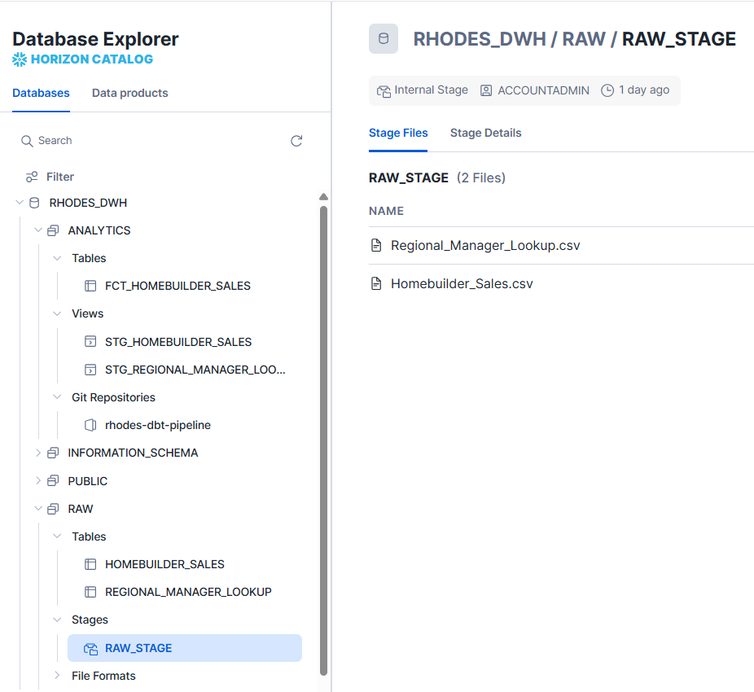
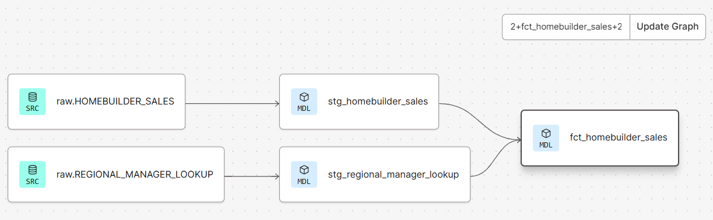

Welcome to the Rhodes Analytics dbt project!

### Resources:
- Streamlit app [dashboard](https://rhodes-snow-flake-dbt-dash.streamlit.app/)
- GitHub repo [link](https://github.com/edisoncoronado/rhodes-dbt-pipeline/))
  
This project uses Snowflake for data storage. Here is the image of the Database Explorer

Also in the project dbt is used to transform the data in Snowflake. Here is a glimpse of the data flow diagram

